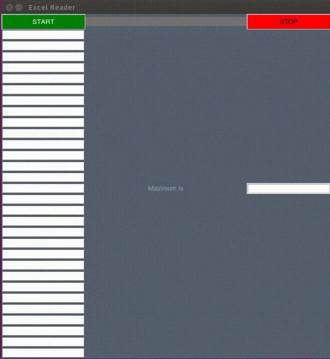

# excel-cell-reader

A small python GUI utility to monitor changes and find sum of values in a specific cell of an excel spreadsheet.
The program reads data from an excel sheet cell every 2 seconds and writes it into a list with 30 indices. 
When last index is not empty, the program will sum up all indices values and delete all values from indices and repeat the procedure.
All the 30 values and the sum value is displayed in a user friendly GUI with the ability to start and stop the program on button clicks.

### Dependency:
Xlrd module for python.
